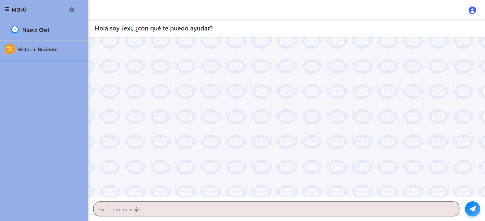
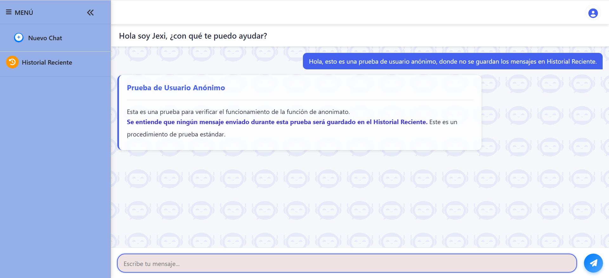
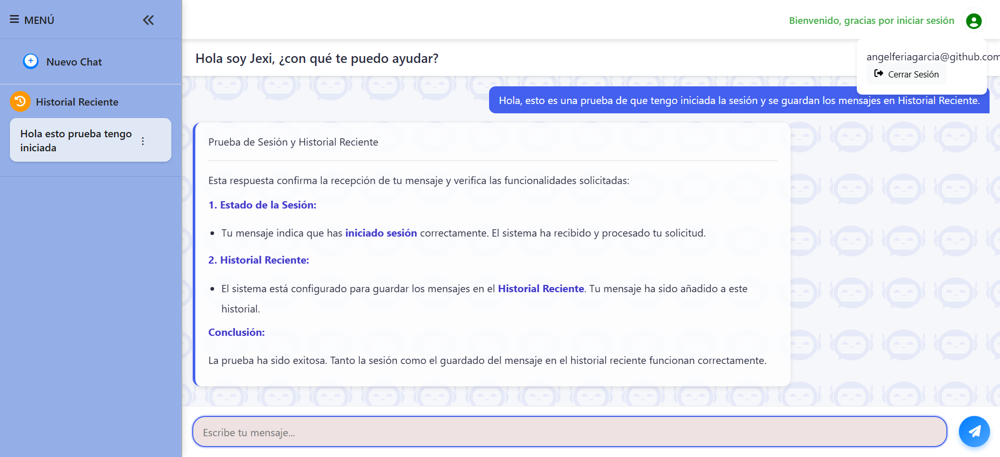
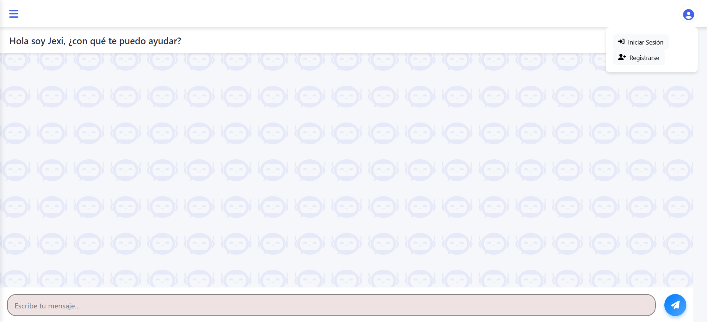
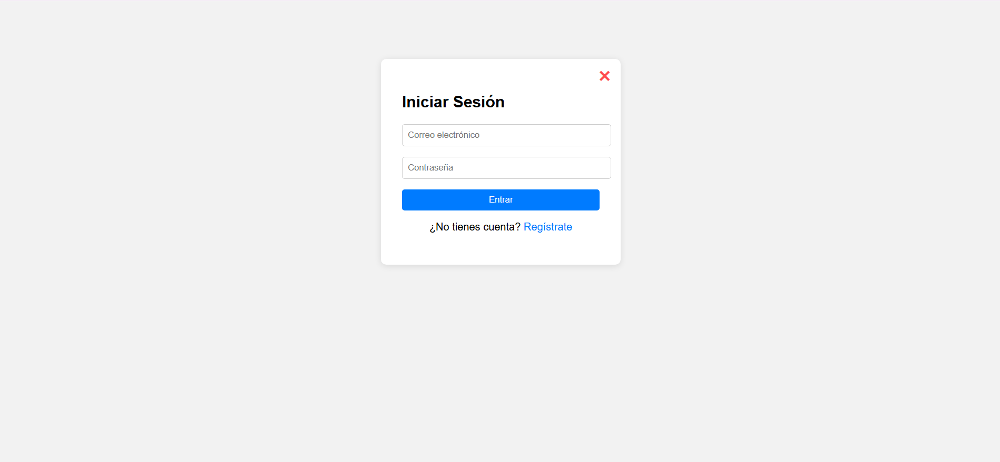
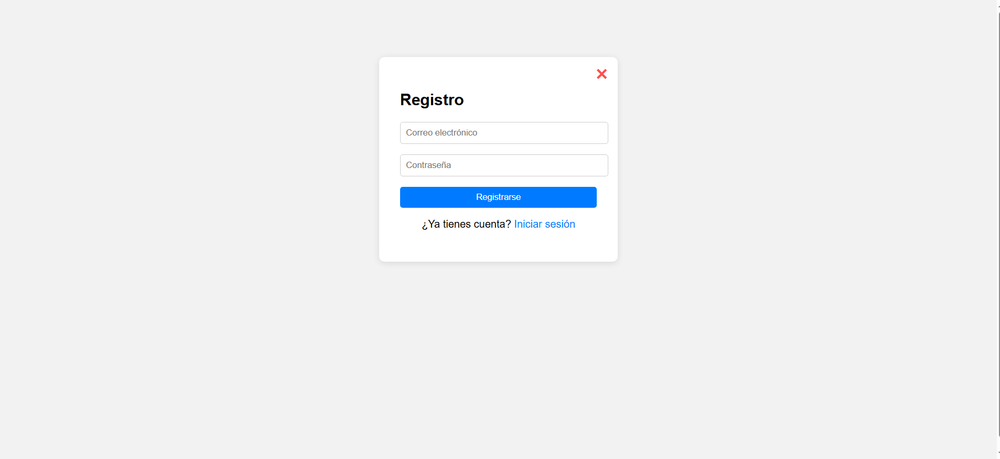
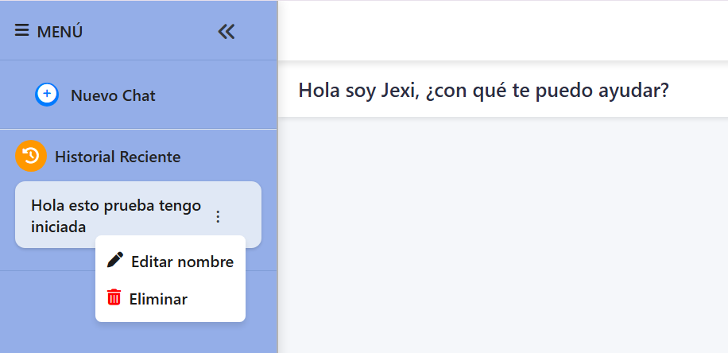

# Jexi Chatbot

¡Bienvenido/a a **Jexi Chatbot**!  
Una aplicación web avanzada construida con **Firebase**, **Node.js**, **MySQL** y **Gemini Pro**, que permite a los usuarios mantener conversaciones inteligentes, guardar sus chats, autenticarse de forma segura y mucho más.

---

## Características principales

- Chat inteligente con modelo **Gemini Pro (Google)**.
- Historial conversacional con funciones completas:
  - Crear nuevas conversaciones
  - Editar títulos
  - Eliminar chats
- Almacenamiento de mensajes, registro y contraseñas de usuario(hash) si el usuario tiene iniciada la sesión en:
  - **MySQL** para estructura y persistencia
  - **Firebase Realtime Database** como sistema alternativo
  - No funciona en modo anónimo el guardado de chats.
- Registro e inicio de sesión seguros usando Firebase Auth + MySQL.
- Middleware de autenticación con tokens Firebase.
- Interfaz con diseño moderno y claro.
- Respuestas con Markdown y resaltado de sintaxis.
- Menú desplegable de usuario y control total de sesión.
- Incorporación de tooltips y ventanas emergentes informativas para mejorar la experiencia del usuario mediante mensajes contextuales y guía interactiva.

---

## Capturas del proyecto

<strong>Interfaz de conversación</strong>

<strong>Autenticación</strong>

  

<strong>Historial de chats</strong>

---

## Arquitectura del proyecto

- Backend con Express, MySQL y Firebase Admin SDK.
- Frontend en HTML, JS modular y Firebase SDK.
- Comunicación con Gemini Pro para generación de contenido.

---

## Autenticación

<strong>Firebase + MySQL</strong>

- Registro en Firebase y base de datos MySQL de forma sincronizada.
- Inicio de sesión doblemente verificado.
- Middleware `verifyToken` para proteger rutas backend.
- Datos del usuario almacenados también en Firebase Realtime Database (`/users/{uid}`).

---

## Motor de IA (Gemini Pro)

<strong>Google Gemini Pro</strong>

- Se utiliza la API `generateContent` con clave de acceso (`API_KEY`).
- Se conserva el contexto conversacional usando el historial (`chatHistory`).
- Las respuestas se convierten a HTML desde Markdown.
- Estructura enriquecida: títulos, listas, código formateado.

---

## Base de datos y persistencia

<strong>MySQL</strong>

- Tablas:
  - `usuarios`: credenciales y perfil
  - `conversaciones`: historial por usuario
  - `mensajes`: contenido del chat con tipo (`user`, `bot`)
- Guardado ordenado y estructurado.
- CRUD completo para conversaciones (crear, leer, actualizar, borrar).

<strong>Firebase Realtime Database</strong>

- Alternativa de guardado por UID en la rama `/conversaciones/`.
- Datos del usuario accesibles y configurables desde `/users/`.
- Guarda cada mensaje con fecha y contenido.

---

## Requisitos

- Navegador moderno (Chrome, Firefox, Edge…)
- Node.js v18 o superior
- MySQL Server corriendo localmente o en la nube
- Cuenta de Firebase configurada (Auth + Realtime DB habilitados)
- Editor recomendado: Visual Studio Code + Live Server

---

## Tecnologías utilizadas

- Frontend
    HTML5 + CSS3

    JavaScript ES Modules

    Firebase SDK (Auth, Realtime DB)

    Marked.js (Markdown → HTML)

    Highlight.js (resaltado de sintaxis)

- Backend
    Node.js + Express

    MySQL2

    Firebase Admin SDK

    CORS, dotenv

    Bcrypt

    node-fetch

- Inteligencia Artificial
    Gemini Pro (Google AI)

    API: generateContent

    Modelo: gemini-1.5-flash-latest

---

## ¿Te gustó el proyecto? ¿Quiéres valorarme?

Tu feedback es muy importante para seguir mejorando esta app.
Si te ha gustado este proyecto, puedes ayudarme de estas formas:

* Dándole una estrella al repositorio.  
* Dejando tu opinión, sugerencia o mejora en la sección de "Discussions", ¡lo agradeceré un montón para poder seguir mejorando, aprendiendo y evolucionando!
* Compartiendo el proyecto con otras personas interesadas en JavaScript y APIs.

[Comenta y deja tu reseña o comentario](https://github.com/AngelFeriaGarcia/AppChatBot/discussions)

